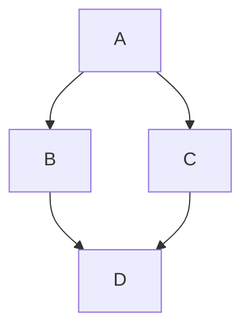

<!-- PROJECT LOGO -->
<br />
<div align="center">
  <a href="#">
    
  </a>

  <h3 align="center">go-grip</h3>

  <p align="center">
    Render your markdown files local<br>- with the look of GitHub
  </p>
</div>

## Table of Contents

- [Table of Contents](#table-of-contents)
- [:question: About](#question-about)
- [:twisted\_rightwards\_arrows: Fork status](#twisted_rightwards_arrows-fork-status)
- [:sparkles: Differences from upstream](#sparkles-differences-from-upstream)
- [:zap: Features](#zap-features)
- [:rocket: Getting started](#rocket-getting-started)
  - [Download a prebuilt binary](#download-a-prebuilt-binary)
  - [Install with Go](#install-with-go)
- [:package: Releasing](#package-releasing)
- [:hammer: Usage](#hammer-usage)
- [:pencil: Examples](#pencil-examples)
- [:bug: Known TODOs / Bugs](#bug-known-todos--bugs)
- [:pushpin: Similar tools](#pushpin-similar-tools)

## :question: About

**go-grip** is a lightweight, Go-based tool designed to render Markdown files locally, replicating GitHub's style. It offers features like syntax highlighting, dark mode, and support for mermaid diagrams, providing a seamless and visually consistent way to preview Markdown files in your browser.

This project is a reimplementation of the original Python-based [grip](https://github.com/joeyespo/grip), which uses GitHub's web API for rendering. By eliminating the reliance on external APIs, go-grip delivers similar functionality while being fully self-contained, faster, and more secure - perfect for offline use or privacy-conscious users.

## :twisted_rightwards_arrows: Fork status

This repository is a fork of [chrishrb/go-grip](https://github.com/chrishrb/go-grip).

The main purpose of this fork is to add extra Markdown preview support for cases where a single-file preview is not enough. These changes are intended to make local documentation folders easier to browse and use, especially when working with multiple Markdown files or long documents.

At the moment, this fork is maintained as a separate modified version and does not plan to open a pull request against the upstream repository.

## :sparkles: Differences from upstream

Compared with the upstream repository, this fork focuses on local documentation browsing and smoother long-document navigation.

Additional documentation browsing support:

- Directory mode: running `go-grip` or `go-grip .` opens a documentation view for all Markdown files in the current directory.
- Multi-file navigation: directory mode adds an article sidebar so related Markdown files can be opened without restarting the server.
- Custom directory targets: running `go-grip docs` opens Markdown files from another directory.

Additional table-of-contents support:

- Each rendered article gets its own table of contents.
- The active TOC item updates while scrolling through the article.
- Long TOCs automatically scroll to keep the active item visible.
- When the page reaches the bottom, the final TOC entry can become active even if the last heading cannot scroll to the top marker.

Additional server behavior:

- If the default port is busy, go-grip automatically tries the next available port.
- If a port is explicitly set with `-p`, go-grip treats that port as strict and reports an error when it is unavailable.
- `--no-reload` disables automatic browser reload on file changes.

Distribution changes:

- This fork uses the module path `github.com/showgp/go-grip`.
- GitHub Releases publish prebuilt macOS, Linux, and Windows binaries.
- Release archives include checksums for download verification.

## :zap: Features

- :zap: Written in Go :+1:
- 📄 Render markdown to HTML and view it in your browser
- Browse all Markdown files in a directory from a local documentation sidebar
- Multi-file Markdown preview with article navigation
- Optional recursive directory sidebar with `-r`
- Per-page table of contents for rendered documents
- Active table-of-contents highlighting while scrolling
- 📱 Dark and light theme
- 🎨 Syntax highlighting for code
- [x] Todo list like the one on GitHub
- Support for github markdown emojis :+1:
- Support for mermaid diagrams
- hashtag linking in page (see table of contents)
- math expressions (code, inline, block)
- gh issues and prs #46 and grafana/grafana#22
- toggle state is preserved in [sessionStorage](https://developer.mozilla.org/en-US/docs/Web/API/Window/sessionStorage)
- automatic fallback to the next available port when the default port is busy
- strict explicit port handling with `-p`
- optional automatic browser reload control with `--no-reload`

This is an inline $\sqrt{3x-1}+(1+x)^2$ function.

$$\left( \sum_{k=1}^n a_k b_k \right)^2 \leq \left( \sum_{k=1}^n a_k^2 \right) \left( \sum_{k=1}^n b_k^2 \right)$$

```math
\left( \sum_{k=1}^n a_k b_k \right)^2 \leq \left( \sum_{k=1}^n a_k^2 \right) \left( \sum_{k=1}^n b_k^2 \right)
```



```go
package main

import "github.com/showgp/go-grip/cmd"

func main() {
	fmt.Sprintln("Welcome to Grip! Use `go-grip --help` for more information.")
}
```

> [!TIP]
> Support of blockquotes (note, tip, important, warning and caution) [see here](https://github.com/orgs/community/discussions/16925)

> [!IMPORTANT]
>
> test

## :rocket: Getting started

### Download a prebuilt binary

The easiest way to install go-grip is to download the archive for your operating system from the [latest release](https://github.com/showgp/go-grip/releases/latest).

Available release builds:

- macOS: `go-grip_<version>_darwin_amd64.tar.gz` or `go-grip_<version>_darwin_arm64.tar.gz`
- Linux: `go-grip_<version>_linux_amd64.tar.gz` or `go-grip_<version>_linux_arm64.tar.gz`
- Windows: `go-grip_<version>_windows_amd64.zip` or `go-grip_<version>_windows_arm64.zip`

For macOS and Linux:

```bash
tar -xzf go-grip_<version>_<os>_<arch>.tar.gz
chmod +x go-grip
./go-grip --help
```

For Windows, unzip the downloaded archive and run:

```powershell
.\go-grip.exe --help
```

### Install with Go

If you have Go installed, you can also build and install directly from this fork:

```bash
go install github.com/showgp/go-grip@latest
```

> [!TIP]
> You can also use nix flakes to install this plugin.
> More useful information [here](https://nixos.wiki/wiki/Flakes).

## :package: Releasing

This fork publishes release archives automatically when a version tag is pushed.

```bash
git tag v0.1.0
git push github v0.1.0
```

The release workflow runs tests, builds macOS/Linux/Windows binaries, uploads archives to GitHub Releases, and includes `checksums.txt` for verification.

> [!IMPORTANT]
> Push release tags one at a time. Do not use `git push --tags` for releases: if multiple tags are created in one push, GitHub may skip creating tag push events, so the release workflow will not run.
>

## :hammer: Usage

To render a single Markdown file, execute:

```bash
go-grip README.md
```

Single-file mode renders only the selected article and adds a table of contents for the current page.

To browse all Markdown files in the current directory, execute:

```bash
go-grip
# or
go-grip .
```

Directory mode opens a local documentation view with a sidebar that links to each Markdown file in the directory. The selected article is rendered in the main area with its own table of contents.

You can also open another directory:

```bash
go-grip docs
```

To include Markdown files from subdirectories and show them as a nested sidebar tree:

```bash
go-grip -r docs
# or
go-grip --recursive docs
```

The browser will automatically open on http://localhost:6419. If that default port is already in use, go-grip will automatically try the next available port. You can disable opening the browser with the `-b=false` option.

You can specify a strict port:

```bash
go-grip -p 8080 README.md
```

When a port is specified explicitly, go-grip will report an error if that port is unavailable.

To disable automatic browser reload on file changes (useful for stable editing):

```bash
go-grip --no-reload README.md
```

To terminate the current server simply press `CTRL-C`.

## :pencil: Examples


## :bug: Known TODOs / Bugs

- [ ] Make it possible to export the generated html

## :pushpin: Similar tools

This tool is a Go-based reimplementation of the original [grip](https://github.com/joeyespo/grip), offering the same functionality without relying on GitHub's web API.
