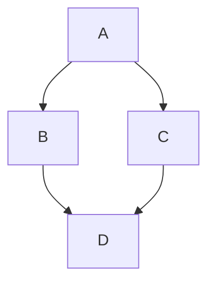

<!-- PROJECT LOGO -->
<br />
<div align="center">
  <a href="#">
    
  </a>

  <h3 align="center">go-grip</h3>

  <p align="center">
    Render your markdown files local<br>- with the look of GitHub
  </p>
</div>

## Table of Contents

- [Table of Contents](#table-of-contents)
- [:question: About](#question-about)
- [:twisted\_rightwards\_arrows: Fork status](#twisted_rightwards_arrows-fork-status)
- [:sparkles: Differences from upstream](#sparkles-differences-from-upstream)
- [:zap: Features](#zap-features)
- [:rocket: Getting started](#rocket-getting-started)
  - [Download a prebuilt binary](#download-a-prebuilt-binary)
  - [Install with Go](#install-with-go)
  - [macOS menu bar app (candidate)](#macos-menu-bar-app-candidate)
- [:package: Releasing](#package-releasing)
- [:hammer: Usage](#hammer-usage)
- [:pencil: Examples](#pencil-examples)
- [:bug: Known TODOs / Bugs](#bug-known-todos--bugs)
- [:pushpin: Similar tools](#pushpin-similar-tools)

## :question: About

**go-grip** is a lightweight, Go-based tool designed to render Markdown files locally, replicating GitHub's style. It offers features like syntax highlighting, dark mode, and support for mermaid diagrams, providing a seamless and visually consistent way to preview Markdown files in your browser.

This project is a reimplementation of the original Python-based [grip](https://github.com/joeyespo/grip), which uses GitHub's web API for rendering. By eliminating the reliance on external APIs, go-grip delivers similar functionality while being fully self-contained, faster, and more secure - perfect for offline use or privacy-conscious users.

## :twisted_rightwards_arrows: Fork status

This repository is a fork of [chrishrb/go-grip](https://github.com/chrishrb/go-grip).

The main purpose of this fork is to add extra Markdown preview support for cases where a single-file preview is not enough. These changes are intended to make local documentation folders easier to browse and use, especially when working with multiple Markdown files or long documents.

At the moment, this fork is maintained as a separate modified version and does not plan to open a pull request against the upstream repository.

## :sparkles: Differences from upstream

Compared with the upstream repository, this fork focuses on local documentation browsing and smoother long-document navigation.

Additional documentation browsing support:

- Directory mode: running `go-grip` or `go-grip .` opens a documentation view for all Markdown files in the current directory.
- Multi-file navigation: directory mode adds an article sidebar so related Markdown files can be opened without restarting the server.
- Custom directory targets: running `go-grip docs` opens Markdown files from another directory.
- The article sidebar title uses the selected directory name, making it easier to identify the active documentation folder.
- The article sidebar sorts directories before files at each level, then sorts entries by name.
- Recursive directory navigation is available with `-r` or `--recursive`, showing nested Markdown files as a collapsible tree.
- Directory mode adds previous/next article navigation and supports the left/right arrow keys for moving between articles.
- Sidebar search box: type to filter articles in real time. Directories auto-expand when they contain matching files. Press `Escape` to clear, or use `Ctrl+F` / `Cmd+F` to jump to the search box.

Additional table-of-contents support:

- Each rendered article gets its own table of contents.
- The active TOC item updates while scrolling through the article.
- Long TOCs automatically scroll to keep the active item visible.
- Clicking a TOC item keeps that item stable while the article scrolls to the target heading, avoiding jumpy TOC movement.
- When the page reaches the bottom, the final TOC entry can become active even if the last heading cannot scroll to the top marker.

Additional server behavior:

- If the default port is busy, go-grip automatically tries the next available port.
- If a port is explicitly set with `-p`, go-grip treats that port as strict and reports an error when it is unavailable.
- `--no-reload` disables automatic browser reload on file changes.
- Hot reload watches directories rather than the whole tree: the served directory, or — with `--recursive` — every directory holding Markdown plus its ancestors. Dependency and build directories (`node_modules`, `.git`, `dist`, `.venv`, …) are skipped. The watch budget is measured in what watching actually costs on the platform — one descriptor per directory entry on macOS/BSD, one inotify watch per directory on Linux — so a tree is watched as long as its documents fit, and the reloader logs what it had to leave out rather than silently failing. When the macOS app hosts the preview, known incomplete watch coverage and target access failures are reported to the app as structured session state while the preview keeps serving accessible content for manual refresh; the standalone CLI keeps logging them.
- A subfolder that denies read permission does not fail the preview of its accessible parent folder: directory discovery skips that subtree — it is not listed in the sidebar and is not used for the initial article — while the readable documents keep being served recursively, and the missing watch coverage is reported as the known hot-reload degradation (logged by the CLI, structured session state when the macOS app hosts the preview). Direct requests inside such a subtree still follow the actual filesystem permissions. An unreadable selected folder or file still fails an open, and a subfolder that fails for a reason other than denied read permission keeps the existing failure behavior.

Additional editor support:

- In-browser Markdown editing with save-to-disk: click the Edit button on any Markdown page to open a split-screen editor.
- Split-screen live preview renders the compiled Markdown in real time as you type (powered by [marked.js](https://marked.js.org/)).
- Scroll synchronization keeps the editor textarea and preview panel aligned by scroll percentage.
- Custom `.md`-only file watcher (replaces `aarol/reload`) with WebSocket-based hot reload, exponential backoff reconnection, and debounced change events.
- Keyboard shortcuts: `Ctrl+S` saves and reloads the browser, `Ctrl+Enter` saves and stays in the editor, `Ctrl+P` toggles the preview panel.
- In-editor image import: click the **Import** button in the editor toolbar to open an import dialog. Drag & drop images or folders, use the file picker, paste from clipboard, or enter a URL. Single-image imports are inserted directly at the cursor; batch imports go to a pending tray for selective placement.

Additional export support:

- **HTML export**: export any rendered Markdown file as a standalone HTML page via the toolbar Export HTML button. The exported file inlines all CSS (light theme, syntax highlighting, mermaid, mathjax, clipboard styles), embeds local images as base64 data URIs, and optionally includes MathJax/Mermaid JavaScript for dynamic rendering.
- **PDF export**: export any rendered Markdown file as a print-optimized PDF via the toolbar Export PDF button. PDF generation uses a headless Chrome/Chromium instance (chromedp) with A4 page layout, proper margins, and a stripped print CSS that removes URL annotations. Local images are embedded automatically. Requires Chrome or Chromium installed on the system.
- Image embedding: local image files referenced in Markdown are automatically converted to inline base64 data URIs in both HTML and PDF exports, making the exported files fully self-contained.

Distribution changes:

- This fork uses the module path `github.com/showgp/go-grip`.
- GitHub Releases publish prebuilt macOS, Linux, and Windows binaries.
- Release archives include checksums for download verification.

## :zap: Features

- :zap: Written in Go :+1:
- 📄 Render markdown to HTML and view it in your browser
- Browse all Markdown files in a directory from a local documentation sidebar
- Multi-file Markdown preview with article navigation
- Optional recursive directory sidebar with `-r`
- Directory sidebar titles show the active directory name
- Directory-first sidebar sorting for mixed folder/file lists
- Sidebar search box to filter articles by filename in real time
- Previous/next article links with left/right keyboard navigation
- Per-page table of contents for rendered documents
- Active table-of-contents highlighting while scrolling
- 📱 Dark and light theme
- 🎨 Syntax highlighting for code
- [x] Todo list like the one on GitHub
- Support for github markdown emojis :+1:
- Support for mermaid diagrams
- hashtag linking in page (see table of contents)
- math expressions (code, inline, block)
- gh issues and prs #46 and grafana/grafana#22
- toggle state is preserved in [sessionStorage](https://developer.mozilla.org/en-US/docs/Web/API/Window/sessionStorage)
- In-browser Markdown editing with save-to-disk (Edit/Save/Cancel workflow)
- Split-screen live preview with real-time Markdown rendering
- Scroll synchronization between editor and preview panels
- Custom polling detects external file changes while editing, with prompt to reload or keep edits
- `Ctrl+S` save-and-reload, `Ctrl+Enter` save-and-stay, `Ctrl+P` toggle preview
- Draggable split divider to resize editor/preview panels (persisted in sessionStorage)
- Preview panel toggle button for distraction-free editing
- In-editor image import: import images via drag-drop, file picker, clipboard paste, or URL. Single images insert directly at cursor; batches queue in a pending tray for selective placement. Images are copied to an `images/` subdirectory next to the edited file with automatic dedup and rename.
- Custom `.md`-only file watcher with WebSocket hot-reload and exponential backoff reconnection
- Debounced rendering (150ms default, scales to 300ms for 5000+ line documents)
- **Export HTML**: download any rendered Markdown as a standalone HTML file (inline CSS, embedded images)
- **Export PDF**: download any rendered Markdown as a print-optimized PDF (A4 layout, headless Chrome/chromedp)
- Image embedding: local images are automatically base64-encoded and inlined in exported HTML/PDF
- automatic fallback to the next available port when the default port is busy
- strict explicit port handling with `-p`
- optional automatic browser reload control with `--no-reload`

This is an inline $\sqrt{3x-1}+(1+x)^2$ function.

$$\left( \sum_{k=1}^n a_k b_k \right)^2 \leq \left( \sum_{k=1}^n a_k^2 \right) \left( \sum_{k=1}^n b_k^2 \right)$$

```math
\left( \sum_{k=1}^n a_k b_k \right)^2 \leq \left( \sum_{k=1}^n a_k^2 \right) \left( \sum_{k=1}^n b_k^2 \right)
```


```mermaid
graph TD;
    A-->B;
    A-->C;
    B-->D;
    C-->D;
```

```go
package main

import "github.com/showgp/go-grip/cmd"

func main() {
	fmt.Sprintln("Welcome to Grip! Use `go-grip --help` for more information.")
}
```

> [!TIP]
> Support of blockquotes (note, tip, important, warning and caution) [see here](https://github.com/orgs/community/discussions/16925)

> [!IMPORTANT]
>
> test

## :rocket: Getting started

### Download a prebuilt binary

The easiest way to install go-grip is to download the archive for your operating system from the [latest release](https://github.com/showgp/go-grip/releases/latest).

Available release builds:

- macOS: `go-grip_<version>_darwin_amd64.tar.gz` or `go-grip_<version>_darwin_arm64.tar.gz`
- Linux: `go-grip_<version>_linux_amd64.tar.gz` or `go-grip_<version>_linux_arm64.tar.gz`
- Windows: `go-grip_<version>_windows_amd64.zip` or `go-grip_<version>_windows_arm64.zip`

For macOS and Linux:

```bash
tar -xzf go-grip_<version>_<os>_<arch>.tar.gz
chmod +x go-grip
./go-grip --help
```

For Windows, unzip the downloaded archive and run:

```powershell
.\go-grip.exe --help
```

### Install with Go

If you have Go installed, you can also build and install directly from this fork:

```bash
go install github.com/showgp/go-grip@latest
```

> [!TIP]
> You can also use nix flakes to install this plugin.
> More useful information [here](https://nixos.wiki/wiki/Flakes).

### macOS menu bar app (candidate)

The native macOS host ships as a self-contained, ad-hoc signed candidate built from source:

```bash
make macos-candidate  # Release archive -> candidate App zip + DMG, signed and checked
make macos            # Development Release build of the same universal host
make macos-run        # Debug build, then launch
make macos-test       # Swift host behavior suite driven by the real Go tool
```

`make macos-candidate` archives the app explicitly to `macos/.build/GoGrip.xcarchive` and writes the candidate to `macos/.build/candidate/`: `GoGrip.app.zip` (a structure-, permission- and signature-preserving archive of the app) and `GoGrip.dmg` (drag-to-install image with the `/Applications` entry). The archive is built Release with `ARCHS = arm64 x86_64` and `ONLY_ACTIVE_ARCH = NO` on the macOS 13.0 deployment target; `macos/Scripts/build-go-grip.sh` builds the bundled Go tool with `CGO_ENABLED=0` for arm64 and amd64, merges both slices into `Contents/MacOS/go-grip`, and ad-hoc signs it under its own identifier before Xcode signs the host. `make macos-candidate-check` verifies both signatures, identifiers and architectures. The macOS CI jobs run the same commands and publish the App zip and DMG as candidate workflow artifacts; the tag pipeline no longer uploads an App DMG to the GitHub Release, and the standalone CLI release archives are unchanged.

Install by opening `GoGrip.dmg` and dragging `GoGrip.app` to Applications (or using the `/Applications` link). Candidate artifacts downloaded from a CI run are unpacked with `ditto -x -k GoGrip.app.zip <directory>` (this preserves the bundle structure, executable permissions and signature; a downloaded copy is quarantined, so macOS asks for confirmation on first launch). The candidate is ad-hoc signed (`com.showgp.GoGrip`, tool `com.showgp.GoGrip.go-grip`), not Developer ID signed or notarized: rebuilds may reset earlier authorizations, and none of this is a public-release install experience.

To upgrade, stop the old host's preview sessions and quit it first, then replace the app; do not keep two installed copies of `com.showgp.GoGrip` side by side, or LaunchServices may start the other one. To roll back, stop the candidate's owned sessions and quit, then use a previously saved copy of the app or the standalone CLI — the new recent-targets store is separate, is not migrated to or from the old `go-grip-history` defaults, and nothing in this stage restores old PIDs, ports or services.

The candidate app places the bundled `go-grip` at `Contents/MacOS/go-grip` and ad-hoc signs both the tool and the host; it does not read the source tree, `PATH` or `Contents/Resources` at runtime. Its current candidate state:

- The menu bar panel opens **one or more** directories and `.md` files in a single standard open panel. Every selected target is prepared and deduplicated in the background before anything starts: the same target selected twice or through a symbolic link becomes one preview session, unsupported files are reported instead of being replaced by their parent directory, and a directory, its parent and a file inside it stay separate targets.
- More than five distinct valid targets ask for confirmation first with the actual number; until you approve, nothing is started or reopened, including targets that already have a running preview. Cancelling leaves existing sessions, their addresses and their process state untouched. The confirmation itself does not block the app: a Finder service request or a panel action arriving while it is visible is still handled, and only the batch waiting for the answer is held back.
- The approved batch is processed one target at a time on the same owned sessions as a single open. A target that cannot be prepared, started or opened in the browser does not stop the rest, and all failures of the batch are reported once in a single native alert naming each target and the reason that was available; the alert appears immediately even when the menu bar panel was never opened (for example a Finder service request that fails right after a cold start), and the panel keeps that report visible under the session list. The prompt is a normal non-blocking window: while it is visible the app still handles Finder service requests and panel actions, and several failure reports are shown one after the other instead of stacking. A batch where everything succeeded shows no extra prompt.
- A running session can reopen the browser, copy its actual URL, or be stopped; "Stop All" stops every session this app owns, and quitting stops them before the app exits.
- The panel keeps up to **20 recent targets** below the running sessions, most recently used first, with the path you selected. Only a verified running session enters the list, so an alias of the same target does not duplicate and a failed or cancelled open does not appear; a browser request that the system refused keeps the session and its recent entry. **Open** on a recent row reuses a running session (same PID, URL and browser request) or opens the target through the same batch path as every other entry; a deleted or moved target reports its original path and the available reason with the same check guidance as any failed open. Restarting the app restores this list only: it starts no service, visits no target and opens no browser page until you explicitly reopen one. The list starts empty: the old example app's 50-item history is left untouched and is never read.
- **Clear** empties only the recent list. Running sessions keep their URL and their Open/Copy/Stop controls and keep serving; if you do not open anything afterwards, the list stays empty on the next launch too.
- On first launch the app shows a short guide to the Finder workflow: select a folder or `.md` file, choose **Services → Open with GoGrip**, and read the preview in the default browser. If the command is missing, open **System Settings → Keyboard → Keyboard Shortcuts… → Services** and make sure GoGrip's service is enabled — the app never enables the service for you, and a successful app launch does not by itself prove the menu is visible. The guide can be reopened any time with **Help** in the panel, including while the service is disabled, and it also explains the access it relies on: ordinary targets need no extra permission, and when macOS asks while opening a target you allow the GoGrip app under **Privacy & Security → Files and Folders**.
- The interface follows the system language: Simplified Chinese (`zh-Hans`) and English are provided, and any other system language falls back to English — including the Finder Services command name, which is **Open with GoGrip** in English and **用 GoGrip 打开** in Simplified Chinese. There is no in-app language setting. Technical diagnostics (Go failure codes/messages, target and hot-reload reasons, paths, URLs, protocol details) stay verbatim in every language; only the app's own labels, error wrappers and action guidance are localized.
- The built-in Finder Services command is connected: select one or more folders or `.md` files in Finder and invoke **Services → Open with GoGrip** (from the context menu, or the Finder → Services menu). The host does not have to be running first — the system launches this candidate build, the selection enters the same production batch as the app's own open dialog (deduplication, the 5/6 quantity confirmation, one failure report and browser opening included), and the default browser shows the preview. The service deliberately does not filter the selection by file type: it accepts every file URL, so a selection that also contains other files (for example an image) is handled by target — the unsupported ones appear in the batch's single failure report instead of the menu disappearing. The system controls the service menu's placement and enabled state; if the item does not appear, check **System Settings → Keyboard → Keyboard Shortcuts… → Services** and make sure the app was launched at least once from its current location so Launch Services has indexed it. Targets started from Finder and targets opened from the panel share one session identity: reopening either way reuses the running service.
- If the system refuses a browser request, the session keeps running with its verified URL and the panel shows the failure for that target; "Open in Browser" retries and clears the inline error on that session, while the last failed operation or batch report stays available as history. "Copy URL" still gives the working address. A successful request only means the system accepted it, not that the page rendered.
- Access follows what macOS allows per target: ordinary folders and files open with no extra permission, and the app never asks for Full Disk Access, Accessibility or Automation by default and never elevates privileges. When macOS protects a location (for example `~/Documents`) or an external/removable volume, the access triggers the system authorization prompt (`"GoGrip.app" would like to access files in your Documents folder.` / `…on a removable volume.`); the system records the decision for the app (`GoGrip`), and the bundled preview tool is covered by that same app entry rather than getting its own identity (observed on the development build; a rebuilt ad-hoc candidate can trigger the prompt again, see below).
- If an open fails because access is denied or the path/volume is unavailable, the batch's single native report names the target and the reason that was available and adds the checks that can apply — the target's file/folder permissions, the volume's mount or sharing state, or **System Settings → Privacy & Security → Files and Folders** for the GoGrip entry — without asserting one cause or demanding Full Disk Access. A failed open is never shown as a running session or as an empty directory; after you grant or fix the access, open the same target again (the app does not retry or move the target by itself).
- A folder that opens fine but contains a subfolder denying read permission still previews: the readable documents, nested ones included, are served and the session shows the known hot-reload degradation for the subtree discovery skips; direct requests inside that subtree still follow the actual filesystem permissions. If the selected folder or `.md` file itself is unreadable, the open fails as described above.
- When a target or volume becomes unavailable **after** a session started, the session stays in the panel with its address and its Stop control and the browser shows the real access error on the next request instead of an empty directory; the app does not reconnect, restart or move it. Restore the path or volume to serve content again, or stop the session and open the target anew.
- **Launch at login** is opt-in and shown at the bottom of the panel with the registration the system actually reports: **Not set**, **Enabled**, or **Waiting for approval**. Nothing turns it on or off by itself — only the explicit **Turn On** / **Turn Off** button does — and the app shows the status the system reports after the operation, not the value you asked for: a refused operation is reported once with the reason the system gave, and a registration that still needs approval keeps saying so with the check that finishes it (**System Settings → General → Login Items**, reachable with **Open Login Items…**) instead of looking enabled. Login start is never required for the Finder service: with it off and the host not running, the Services command still starts the app and opens the preview.
- Not available yet: previewing a mounted **network** volume has not been verified (no share was available), and network-volume hot reload keeps the known coverage limits described under Usage. The candidate was built and run on Apple Silicon (macOS 27) with both slices statically checked. Actual Intel and macOS 13 runs, mounted-network-volume access and hot-reload degradation, and candidate-level detachable-volume disconnection acceptance are deferred to a follow-up change and remain unverified. Candidate-level acceptance within the approved scope is complete (ticket 13); the candidate was installed and exercised on this machine, while a formal clean install with Developer ID signing and notarization is not yet verified.
- The candidate is ad-hoc signed: rebuilding changes the app's code identity, so macOS may ask for the same authorizations again instead of reusing an earlier grant (observed: after replacing the app, the previous Services-menu enablement under **System Settings → Keyboard → Keyboard Shortcuts… → Services** no longer applied to the new copy, and the service had to be enabled again), and a downloaded copy carries the quarantine flag with the usual system confirmation. It is not Developer ID signed or notarized.
- This stage delivers a functional candidate, not a public release: formal Developer ID signing, notarization, clean-install verification and public distribution are separate, later approvals.

## :package: Releasing

This fork publishes release archives automatically when a version tag is pushed.

```bash
git tag v0.1.0
git push github v0.1.0
```

The release workflow runs tests, builds the macOS/Linux/Windows CLI binaries, uploads those archives to GitHub Releases, and includes `checksums.txt` for verification. The macOS App candidate is delivered separately as workflow artifacts (see the macOS section above) and is not attached to GitHub Releases at this stage.

> [!IMPORTANT]
> Push release tags one at a time. Do not use `git push --tags` for releases: if multiple tags are created in one push, GitHub may skip creating tag push events, so the release workflow will not run.
>

## :hammer: Usage

To render a single Markdown file, execute:

```bash
go-grip README.md
```

Single-file mode renders only the selected article and adds a table of contents for the current page.

To browse all Markdown files in the current directory, execute:

```bash
go-grip
# or
go-grip .
```

Directory mode opens a local documentation view with a sidebar that links to each Markdown file in the directory. The sidebar title shows the selected directory name. When folders and Markdown files appear at the same level, folders are shown first and entries are sorted by name. The selected article is rendered in the main area with its own table of contents and previous/next article navigation.

You can also open another directory:

```bash
go-grip docs
```

To include Markdown files from subdirectories and show them as a nested sidebar tree:

```bash
go-grip -r docs
# or
go-grip --recursive docs
```

The recursive sidebar is collapsible and keeps the active article visible while browsing nested documents. Use the search box above the sidebar to filter articles by filename — matching directories auto-expand, and a "No matching files" message appears when no results are found. Previous/next navigation follows the same order as the sidebar, and the left/right arrow keys can move between articles when the page focus is not inside an editable field.

The browser will automatically open on http://localhost:6419. If that default port is already in use, go-grip will automatically try the next available port. You can disable opening the browser with the `-b=false` option.

You can specify a strict port:

```bash
go-grip -p 8080 README.md
```

When a port is specified explicitly, go-grip will report an error if that port is unavailable.

To disable automatic browser reload on file changes (useful for stable editing):

```bash
go-grip --no-reload README.md
```

To print one startup line with the actual port and preview URL as JSON (useful for tooling):

```bash
go-grip --json README.md
```

The standalone CLI does not read stdin, so closing or never connecting a terminal input does not end the server; only `CTRL-C` (or killing the process) stops it.

> [!NOTE]
> Previews started by the macOS app bind only to `127.0.0.1`. The standalone CLI keeps its existing listen policy and listens on all interfaces, so a `localhost` URL does not by itself mean a standalone server is loopback-only.

To terminate the current server simply press `CTRL-C`.

### Editor mode

When viewing a Markdown file, click the **Edit** button in the toolbar to open the built-in editor. The page switches to a split-screen layout: a textarea on the left for Markdown source and a live preview on the right.

Use the toolbar buttons to:

- **Save** — writes the content to disk and refreshes the browser preview.
- **Cancel** / **Done** — exits edit mode; shows "Cancel" when there are unsaved changes and "Done" when the content matches the saved file.
- **Preview** — toggles the preview panel on/off for distraction-free editing.
- **Import** — opens the image import dialog. Drag & drop images or folders onto the dropzone, click to browse files, or switch to the URL tab to paste an external image link.
- The split divider between editor and preview is draggable; the position is remembered across sessions.

Keyboard shortcuts while editing:

| Shortcut | Action |
|---|---|
| `Ctrl+S` | Save and reload the browser |
| `Ctrl+Enter` | Save and stay in the editor |
| `Ctrl+P` | Toggle preview panel |
| `Esc` | Exit edit mode (same as Cancel/Done) |

#### Importing images

Click the **Import** button in the editor toolbar to open the image import dialog:

- **Local File tab**: drag & drop images or a folder (subdirectories are scanned recursively), or click the dropzone to select files. All images are imported to an `images/` subdirectory next to the edited Markdown file. A single image can be inserted directly at the cursor; batch imports queue in a pending tray at the bottom of the editor. From the tray, click any thumbnail to insert it at the cursor, or use **Insert All** to place them all at once (one per line).
- **URL tab**: paste an external image URL and click Insert to place `` at the cursor immediately.
- **Drag & drop onto the textarea**: single images are imported and inserted directly at the drop position; multiple images or folders go to the pending tray.
- **Clipboard paste**: pasting a screenshot or copied image from a file manager imports it automatically — single images are inserted directly, multiple images go to the pending tray.

If the Markdown file changes on disk while the editor is open (e.g., by another program or `git pull`), go-grip detects the change and shows a dialog: **OK** reloads the latest content into the editor, **Cancel** keeps your edits and suppresses further prompts until the next save.

The browser will reload automatically when a `.md` file changes on disk, unless `--no-reload` is used. The watcher covers the served directory, or — with `--recursive` — every directory holding Markdown below it. Dependency and build directories are skipped, including a `node_modules` that appears after startup.

The watcher spends a budget proportional to the platform resource it consumes (descriptors on macOS/BSD, where each directory costs one per entry inside it; inotify watches on Linux). If a tree does not fit, go-grip logs how many directories it skipped and keeps serving reloads from the ones it did watch.

### Export

When viewing a Markdown file, click the **Export HTML** or **Export PDF** button in the toolbar to download the rendered document.

- **Export HTML** downloads a standalone `.html` file with all CSS inlined (light theme, syntax highlighting, mermaid, mathjax, clipboard) and local images embedded as base64 data URIs. The exported page includes MathJax and Mermaid JavaScript for dynamic rendering.
- **Export PDF** downloads a print-optimized `.pdf` file using a headless Chrome/Chromium instance. The PDF uses A4 page dimensions, proper margins, and a print-tailored CSS that removes URL link annotations. Local images are embedded automatically.

> [!NOTE]
> PDF export requires **Chrome** or **Chromium** installed on your system and available in `PATH`. The server lazy-initializes the PDF generator on the first export request.

## :pencil: Examples


## :bug: Known TODOs / Bugs

- [x] Export rendered Markdown as standalone HTML
- [x] Export rendered Markdown as PDF (requires Chrome/Chromium)

## :pushpin: Similar tools

This tool is a Go-based reimplementation of the original [grip](https://github.com/joeyespo/grip), offering the same functionality without relying on GitHub's web API.
